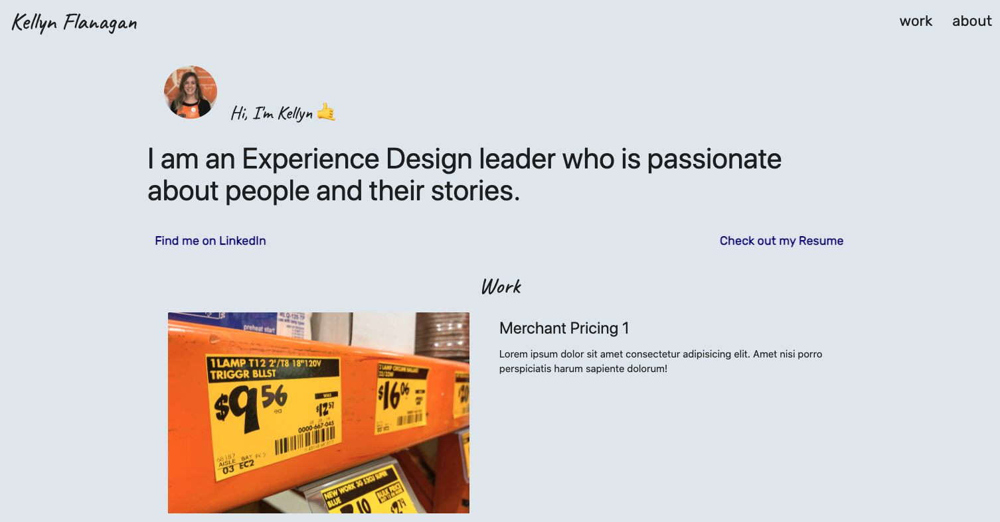
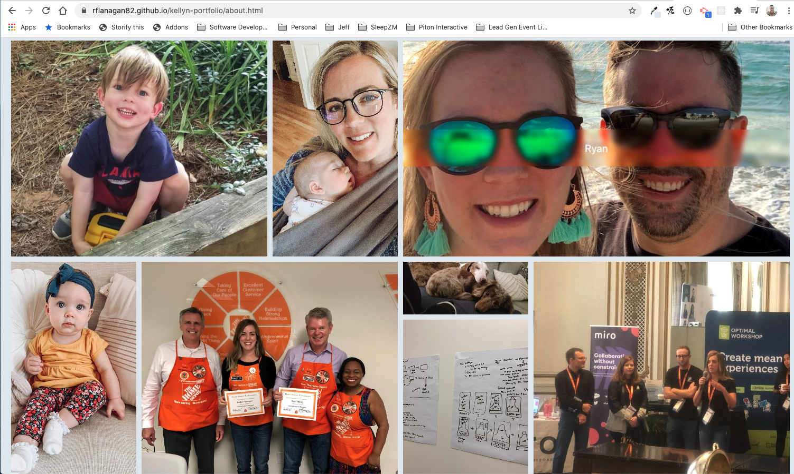

# kellyn-portfolio

## Current Link
https://rflanagan82.github.io/kellyn-portfolio/index.html

## Description
A portfolio site utilizing Materialize CSS, and showcasing a fully mobile responsive gallery grid layout on the about page.

Kellyn specifically wanted a minimalistic design.

## Usage
All of the files necessary to view this website are available in this respository.

## Badge

## Pending Updates
+ Need to customize Kellyn's website copy when ready.
* Update work related images on work/main page.
* Need to link this site to custom domain of hers - www.kellynflanagan.com

## License
MIT License

Copyright (c) [2020] [Ryan Flanagan]

Permission is hereby granted, free of charge, to any person obtaining a copy
of this software and associated documentation files (the "Software"), to deal
in the Software without restriction, including without limitation the rights
to use, copy, modify, merge, publish, distribute, sublicense, and/or sell
copies of the Software, and to permit persons to whom the Software is
furnished to do so, subject to the following conditions:

The above copyright notice and this permission notice shall be included in all
copies or substantial portions of the Software.

THE SOFTWARE IS PROVIDED "AS IS", WITHOUT WARRANTY OF ANY KIND, EXPRESS OR
IMPLIED, INCLUDING BUT NOT LIMITED TO THE WARRANTIES OF MERCHANTABILITY,
FITNESS FOR A PARTICULAR PURPOSE AND NONINFRINGEMENT. IN NO EVENT SHALL THE
AUTHORS OR COPYRIGHT HOLDERS BE LIABLE FOR ANY CLAIM, DAMAGES OR OTHER
LIABILITY, WHETHER IN AN ACTION OF CONTRACT, TORT OR OTHERWISE, ARISING FROM,
OUT OF OR IN CONNECTION WITH THE SOFTWARE OR THE USE OR OTHER DEALINGS IN THE
SOFTWARE.

